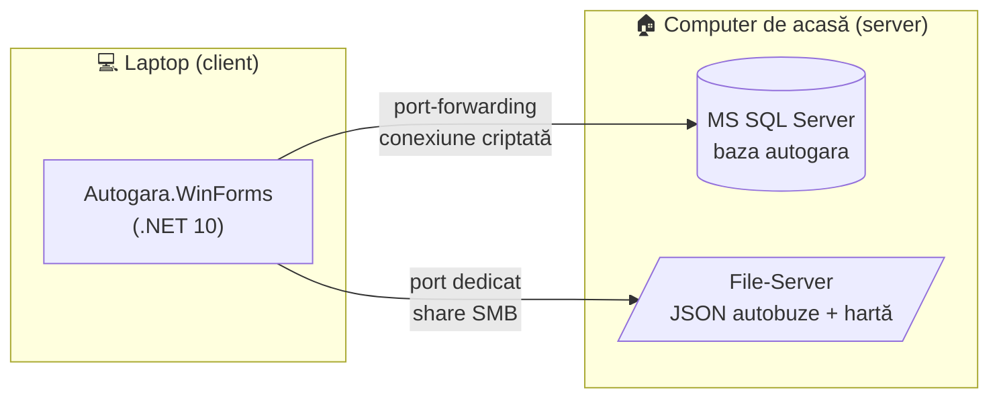

<div align="center">

# 🚌 Autogara — Aplicație de Gestionare a Autogării

**Proiect de echipă · Elemente de Proiectare a Sistemelor Informatice**


</div>

---

## 📋 Despre proiect

Aplicație desktop pentru gestionarea unei autogări. Aplicația permite:

- 🎫 **vânzarea biletelor**, cu alegerea locului pe schema vizuală a autobuzului
- ⏱️ **rezervarea provizorie** a locului, care expiră automat, fără ca doi casieri să vândă același loc
- 💸 **anularea și rambursarea biletelor**, cu reduceri pentru elevi, pensionari și abonament
- 🗺️ **harta proprie a stațiilor**, editată vizual (noduri și conexiuni)
- 🚍 **gestionarea curselor, traseelor, autobuzelor, șoferilor și mentenanței** (inclusiv alerte pentru ITP)
- 📊 **dashboard live și rapoarte** (vânzări zilnice, ocuparea curselor, comparații lunare)
- 👥 **roluri**: Admin, Casier, Pasager

## 🏗️ Arhitectură



| Componentă | Tehnologie |
|---|---|
| Interfață | .NET 10 WinForms (C#) |
| Logică | Class libraries C# (Business, DataAccess, FileServer, Common) |
| Bază de date | Microsoft SQL Server |
| Fișiere | File server cu structura autobuzelor și harta, în format JSON |
| Acces la distanță | Port-forwarding pe router, fără VPN |

## 👥 Echipa

| Rol | Membru | Responsabilitate |
|---|---|---|
| 🗄️ Bază de Date | **Gojinevschii Dmitri** | schemă, views, proceduri, joburi, securitate, backup |
| ⚙️ Backend | **Hanganu Sergiu** | acces la date, autentificare, logica de vânzare, rapoarte, mod offline |
| 🎨 Frontend | **Crivenco Alexandr** | formulare WinForms, editoarele de hartă și autobuz, dashboard |
| 🧪 Tester | **Sopivnic Maxim** | plan de testare, testarea fluxurilor, securitate, backup/restore |

## ✅ ToDo — progres pe etape

> Lucrăm **waterfall**: o etapă se termină complet înainte de a trece la următoarea.

### 🗄️ Bază de Date — Gojinevschii Dmitri
- [x] Convențiile: denumire, collation, chei GUID/IDENTITY, audit, soft-delete, concurență
- [x] Schema și toate tabelele, cu relațiile și constrângerile
- [x] Rolurile și securitatea SQL Server (script gata; criptarea și portul se setează pe server)
- [x] Views pentru rapoarte și interogări frecvente
- [x] Proceduri stocate pentru rezervare, vânzare, anulare și rapoarte
- [x] Joburi SQL Server Agent (script gata; trebuie instalate pe server)
- [x] Indici pentru performanță
- [x] Planul de backup/restore (testat local)
- [ ] Testul de restaurare pe serverul real
- [x] Scriptul de creare a bazei de date și datele de test (seed)
- [ ] Dicționarul de date

### ⚙️ Backend — Hanganu Sergiu
- [ ] Stratul de acces la date și conexiunea la distanță (criptare, retry, reconectare)
- [ ] Autentificarea, autorizarea pe roluri și recuperarea parolei
- [ ] Serviciile pentru hartă (noduri și conexiuni)
- [ ] Parsarea și validarea JSON-urilor cu structura autobuzelor
- [ ] Rezervarea, vânzarea, anularea și rambursarea biletelor
- [ ] Calculul prețurilor și al reducerilor
- [ ] Integrarea cu casa de marcat fiscală (dacă e necesară legal)
- [ ] Rapoartele și datele pentru dashboard-ul live
- [ ] Cache-ul local și sincronizarea în mod offline
- [ ] Logarea erorilor, tranzacțiile și limitarea brute-force

### 🎨 Frontend — Crivenco Alexandr
- [ ] Wizard-ul de configurare inițială și formularul de login
- [ ] Editorul vizual de hartă
- [ ] Editorul vizual de autobuz, cu generarea JSON-ului
- [ ] Formularul de vânzare cu vizualizarea grafică a locurilor
- [ ] Formularele Admin (rute, autobuze, mentenanță, șoferi, stații, trasee, curse, utilizatori)
- [ ] Dashboard-ul live și formularul de rapoarte
- [ ] Validările și mesajele de eroare
- [ ] Indicatorul online/offline și auto-update-ul

### 🧪 Tester — Sopivnic Maxim
- [ ] Planul de testare pe roluri (admin, casier, pasager)
- [ ] Testarea editorului de hartă și a editorului de autobuz
- [ ] Testarea fluxului de vânzare, rezervare provizorie și anulare
- [ ] Testarea concurenței (doi casieri, același loc) și a expirării rezervărilor
- [ ] Testarea conexiunii la distanță și a modului offline
- [ ] Testarea securității și a integrității datelor
- [ ] Testarea rapoartelor, dashboard-ului și joburilor SQL
- [ ] Testarea backup-ului și a restaurării
- [ ] Urmărirea bug-urilor și testarea de regresie înainte de livrare

## 📁 Structura repository-ului

```
📦 Elemente-de-Proiectare-a-Sistemelor-Informatice
 ┣ 📂 App                   → soluția .NET (Autogara.sln) — Backend + Frontend
 ┣ 📂 File-Server           → structura folderelor de pe file server (Autobuze/, Harta/, Backup/)
 ┣ 📂 SQL Code              → scripturile bazei de date, câte unul pe categorie
 ┃ ┣ 📜 00_RunAll.sql         rulează totul în ordine
 ┃ ┣ 📜 01_CreateDatabase.sql
 ┃ ┣ 📜 02_Schema.sql
 ┃ ┣ 📜 03_Tables.sql
 ┃ ┣ 📜 04_Indexes.sql
 ┃ ┣ 📜 05_Functions.sql
 ┃ ┣ 📜 06_Views.sql
 ┃ ┣ 📜 07_StoredProcedures.sql
 ┃ ┣ 📜 08_Security.sql
 ┃ ┣ 📜 09_Jobs.sql
 ┃ ┣ 📜 10_BackupRestore.sql
 ┃ ┗ 📜 11_Seed.sql           date de test realiste
 ┣ 📄 Sarcina Tehnica.docx  → sarcina tehnică aprobată de colegiu
 ┣ 📄 plan.md               → planul tehnic detaliat (structura internă a proiectului)
 ┣ 🔒 Credentials.txt       → credențialele proiectului (repo privat — nu îl faceți public)
 ┗ 📄 README.md
```

## 📚 Documente

| Document | Pentru ce e |
|---|---|
| [Sarcina Tehnica.docx](Sarcina%20Tehnica.docx) | Descrierea generală a aplicației și sarcinile fiecărui membru, **aprobată de colegiu** |
| [plan.md](plan.md) | Planul tehnic detaliat: tabele, proceduri, structura soluției .NET, formulare. E referința pentru implementare |

## 🚀 Pornire rapidă — baza de date

1. Pe server, deschide `SQL Code/00_RunAll.sql` în SSMS și activează **Query → SQLCMD Mode**.
2. Completează variabilele de la începutul fișierului: `ScriptsPath`, `ParolaApp`, `ParolaRapoarte`, `BackupPath`.
3. Rulează cu **F5**. Se creează baza, obiectele, conturile, joburile și datele de test.

Sau din linia de comandă, din folderul `SQL Code`:

```bash
sqlcmd -S <server>,<port> -U <dba> -f 65001 -i 00_RunAll.sql
```

> ℹ️ Datele de test sunt generate relativ la ziua rulării (de la 7 zile în urmă până la 7 zile înainte), ca dashboard-ul să aibă mereu date recente.
> Conturile din seed au parola temporară `Autogara#2026`.

## 🤝 Reguli de lucru

- Lucrăm **direct pe `main`**, fără branch-uri, pentru că nu lucrăm simultan.
- Înainte de lucru: `git pull`. După lucru: commit cu mesaj clar + `git push`.
- Bifează sarcina în secțiunea **ToDo** de mai sus când e gata.
- **Frontend-ul face doar apeluri.** Toată logica stă în Backend; în formulare nu se scrie SQL, JSON sau reguli de business.
